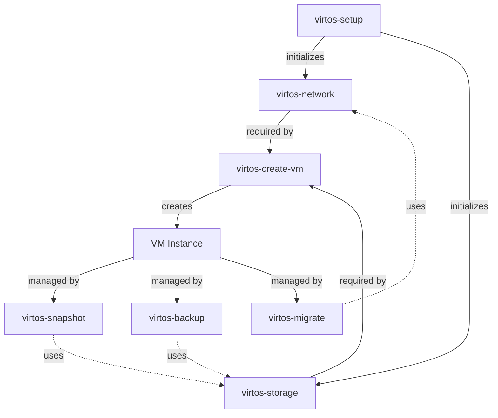
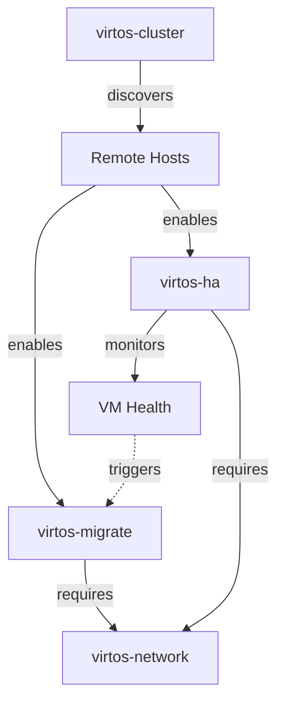
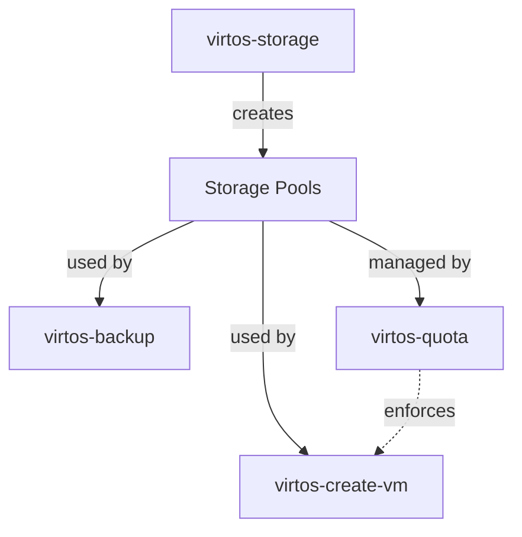

# VirtOS Script-to-Script Dependencies

**Last Updated**: 2026-05-29  
**Version: 0.89  
**Status**: Reference Documentation

## Overview

This document maps dependencies between VirtOS management scripts and their initialization order. For external command dependencies, see [DEPENDENCIES.md](DEPENDENCIES.md).

## Visual Dependency Graphs

### Core VM Lifecycle



### Cluster Operations



### Storage Stack



## Script Dependencies Reference

| Script | Depends On | Optional | Reason |
|--------|-----------|----------|--------|
| virtos-setup | (none) | - | First-run initialization |
| virtos-create-vm | virtos-network, virtos-storage | No | Needs network and storage |
| virtos-snapshot | (none) | - | Uses libvirt directly |
| virtos-backup | (virtos-snapshot) | Yes | Can use snapshots |
| virtos-migrate | virtos-network, (virtos-cluster) | cluster=Yes | Needs network, cluster for multi-host |
| virtos-cluster | (none) | - | Uses avahi directly |
| virtos-ha | virtos-cluster | No | Requires cluster |
| virtos-monitor | (none) | - | Uses libvirt directly |
| virtos-tui | All scripts | Yes | Menu wrapper |

## Initialization Order

### Phase 1: System Setup
```bash
virtos-setup  # First script to run, initializes everything
```

### Phase 2: Infrastructure
```bash
# Network and storage (order doesn't matter)
virtos-network create-nat default 192.168.122.0/24
virtos-storage create-pool default dir /var/lib/libvirt/images
```

### Phase 3: VM Operations
```bash
virtos-create-vm --name web-01
virtos-snapshot create web-01 initial
virtos-backup create web-01
```

## See Also

- [DEPENDENCIES.md](DEPENDENCIES.md) - External command dependencies
- [ARCHITECTURE.md](ARCHITECTURE.md) - High-level architecture
- [QUICK-REFERENCE.md](QUICK-REFERENCE.md) - All script commands

---

**Last Updated**: 2026-05-29  
**Status**: Reference Documentation
