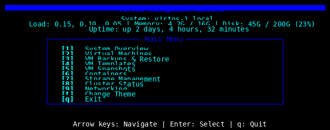

# VirtOS TUI Screenshots Documentation

Visual guide to the themed VirtOS Text User Interface.

## How to Capture Screenshots

### Method 1: Automated Screenshot Tool (Recommended)

VirtOS TUI includes an automated screenshot generator that uses the
[FlossWare curses-themes screenshot_capture.py](https://github.com/FlossWare/curses-themes/blob/main/tools/screenshot_capture.py) tool.

This generates **pixel-perfect PNG screenshots** without requiring a terminal emulator:

```bash
# Install dependencies
pip3 install curses-themes Pillow

# Generate screenshots for all themes
cd build/scripts/tui
python3 generate_virtos_screenshots.py

# Generate for specific theme
python3 generate_virtos_screenshots.py --theme dark

# Generate all views (main menu + VM list)
python3 generate_virtos_screenshots.py --view all

# Create comparison grid
python3 generate_virtos_screenshots.py --create-grid
```

**Output**: PNG files in `docs/screenshots/tui/themes/` and `docs/screenshots/tui/features/`

**Advantages**:

- Pixel-perfect rendering
- Consistent across all platforms
- No terminal emulator required
- Automated for all themes
- Includes comparison grid generation

### Method 2: Terminal Screenshot Tools

```bash
# Using script command (built-in)
script -c "virtos-tui --theme dark" typescript
cat typescript  # View captured output

# Using termtosvg (creates SVG animations)
pip3 install termtosvg
termtosvg virtos-tui.svg -c "virtos-tui --theme dark"

# Using asciinema (record terminal sessions)
pip3 install asciinema
asciinema rec virtos-tui-demo.cast -c "virtos-tui --theme dark"
```

### Method 3: Desktop Screenshots

```bash
# Launch TUI in full-screen terminal
virtos-tui --theme dark

# Use your desktop screenshot tool:
# - Linux: gnome-screenshot, flameshot, scrot
# - macOS: Cmd+Shift+4
# - Windows: Snipping Tool
```

## Screenshot Locations

Place screenshots in:

```
VirtOS/docs/screenshots/tui/
├── main-menu-default.png
├── main-menu-dark.png
├── main-menu-light.png
├── theme-selector.png
├── system-overview.png
├── vm-list.png
├── themes/
│   ├── default-theme.png
│   ├── dark-theme.png
│   ├── light-theme.png
│   ├── ti994a-theme.png
│   ├── trs80-theme.png
│   ├── dos-theme.png
│   ├── dbase3-theme.png
│   └── dbase4-theme.png
└── features/
    ├── semantic-colors.png
    ├── themed-boxes.png
    └── status-indicators.png
```

## Required Screenshots

### 1. Main Menu (All Themes)

Capture the main menu in each theme to show the variety:

#### Default Theme

**Command**: `virtos-tui --theme default`
**File**: `screenshots/tui/themes/default-theme.png`
**Description**: Classic black and white terminal aesthetic

#### Dark Theme

**Command**: `virtos-tui --theme dark`
**File**: `screenshots/tui/themes/dark-theme.png`
**Description**: Professional dark mode with blue/gray tones

#### Light Theme

**Command**: `virtos-tui --theme light`
**File**: `screenshots/tui/themes/light-theme.png`
**Description**: High contrast light mode for bright environments

#### TI-99/4A Theme

**Command**: `virtos-tui --theme ti994a`
**File**: `screenshots/tui/themes/ti994a-theme.png`
**Description**: Retro Texas Instruments computer aesthetic (cyan background)

#### TRS-80 Theme

**Command**: `virtos-tui --theme trs80`
**File**: `screenshots/tui/themes/trs80-theme.png`
**Description**: Classic Tandy Radio Shack monochrome

#### DOS Theme

**Command**: `virtos-tui --theme dos`
**File**: `screenshots/tui/themes/dos-theme.png`
**Description**: MS-DOS classic interface (white on black with yellow highlights)

#### dBASE III Theme

**Command**: `virtos-tui --theme dbase3`
**File**: `screenshots/tui/themes/dbase3-theme.png`
**Description**: Database software interface with cyan menus

#### dBASE IV Theme

**Command**: `virtos-tui --theme dbase4`
**File**: `screenshots/tui/themes/dbase4-theme.png`
**Description**: Windowed database interface with blue background

### 2. Key Features

#### System Overview

**Navigation**: Main menu → Press `1`
**File**: `screenshots/tui/system-overview.png`
**Shows**:

- Hostname and uptime
- Load average
- Memory usage
- Disk usage
- Themed box with system information

#### VM Management Menu

**Navigation**: Main menu → Press `2`
**File**: `screenshots/tui/vm-menu.png`
**Shows**:

- VM submenu options
- List VMs, Start VM, Stop VM options
- Consistent themed styling

#### VM List

**Navigation**: Main menu → Press `2` → Press `1`
**File**: `screenshots/tui/vm-list.png`
**Shows**:

- Running VMs in green (success color)
- Stopped VMs in yellow (warning color)
- Themed box around VM list

#### Theme Selector

**Navigation**: Main menu → Press `t`
**File**: `screenshots/tui/theme-selector.png`
**Shows**:

- List of available themes
- Theme descriptions
- Current theme indicator in footer

#### Backup Menu

**Navigation**: Main menu → Press `3`
**File**: `screenshots/tui/backup-menu.png`
**Shows**:

- Backup management options
- Structured menu layout

### 3. Semantic Colors Demo

Create a composite screenshot showing semantic colors:

**File**: `screenshots/tui/features/semantic-colors.png`
**Shows**:

- Success (green) - Running VMs
- Error (red) - Error messages
- Warning (yellow) - Warnings/stopped VMs
- Info (blue) - Help text in footer
- Primary (cyan) - Title bar
- Accent (purple) - Menu keys

### 4. Comparison Screenshots

#### Side-by-Side Theme Comparison

**File**: `screenshots/tui/theme-comparison.png`
**Layout**: 2x4 grid showing all themes
**Use**: For quick visual comparison

#### Before/After (Dialog vs Python TUI)

**File**: `screenshots/tui/comparison-dialog-vs-python.png`
**Shows**:

- Left: Old dialog-based TUI
- Right: New themed Python TUI
**Purpose**: Highlight improvements

## Screenshot Specifications

### Technical Requirements

- **Resolution**: 1920x1080 minimum
- **Format**: PNG (lossless compression)
- **Terminal Size**: 80x24 minimum (standard VT100)
- **Color Depth**: 24-bit color (true color)
- **Terminal**: xterm-256color or equivalent

### Recommended Terminal Settings

```bash
# Set terminal size
resize -s 30 90  # 30 rows, 90 columns (slightly larger for visibility)

# Enable 256 colors
export TERM=xterm-256color

# Set nice terminal font (optional)
# Use a monospace font like:
# - Fira Code
# - JetBrains Mono
# - Ubuntu Mono
# - Consolas
```

### Capture Settings

#### Using gnome-screenshot

```bash
# Launch TUI
virtos-tui --theme dark

# Capture window (5-second delay)
gnome-screenshot -w -d 5 -f screenshots/tui/main-menu-dark.png
```

#### Using scrot

```bash
# Capture entire screen
scrot -d 5 screenshots/tui/main-menu-dark.png

# Capture focused window
scrot -u -d 5 screenshots/tui/main-menu-dark.png
```

#### Using flameshot

```bash
# Interactive capture
flameshot gui

# Full screen
flameshot full -p screenshots/tui/
```

## Automated Screenshot Generation

### Using the VirtOS Screenshot Generator

The recommended way to generate screenshots:

```bash
cd build/scripts/tui

# Generate all theme screenshots (main menu)
python3 generate_virtos_screenshots.py

# Generate for specific theme
python3 generate_virtos_screenshots.py --theme dark

# Generate all views
python3 generate_virtos_screenshots.py --view all

# Create comparison grid
python3 generate_virtos_screenshots.py --create-grid
```

**How it works**:

1. Uses FlossWare curses-themes screenshot_capture.py
2. Renders terminal output directly to PNG using PIL/Pillow
3. No terminal emulator required
4. Generates pixel-perfect, consistent screenshots
5. Supports all views: main menu, VM list, etc.

### Using curses-themes Screenshot Tool Directly

You can also use the curses-themes tool directly:

```bash
# Clone curses-themes (if not already)
cd ~/Development/github/FlossWare/
git clone https://github.com/FlossWare/curses-themes

# Run screenshot generator
cd curses-themes/tools
python3 screenshot_capture.py --output-dir ../../VirtOS/docs/screenshots/tui/themes

# Create comparison grid
python3 screenshot_capture.py --create-grid --output-dir ../../VirtOS/docs/screenshots/tui
```

### Manual Capture Script

For manual capture (interactive mode), use `capture-screenshots.sh`:

```bash
cd build/scripts/tui

# Manual mode (guides you through each theme)
./capture-screenshots.sh --manual

# Check what's needed
./capture-screenshots.sh --list

# Verify existing screenshots
./capture-screenshots.sh --check
```

## Documentation Integration

### README.md Updates

Add to main README after TUI section:

```markdown
### Theme Gallery

VirtOS TUI includes 8+ professional themes powered by [FlossWare curses-themes](https://github.com/FlossWare/curses-themes):

| Theme | Preview | Style |
|-------|---------|-------|
| Default |  | Classic terminal |
| Dark |  | Modern dark mode |
| Light |  | High contrast |
| TI-99/4A |  | Retro 1981 |

See [TUI_THEMES.md](docs/TUI_THEMES.md) for all themes and customization.
```

### TUI_THEMES.md Updates

Add screenshots to each theme section:

```markdown
#### Dark Theme


**Style**: Professional dark mode  
**Era**: Modern (2020s)  
**Best For**: Low-light coding, reduced eye strain
```

## Screenshot Checklist

- [ ] Main menu - default theme
- [ ] Main menu - dark theme
- [ ] Main menu - light theme
- [ ] Main menu - ti994a theme
- [ ] Main menu - trs80 theme
- [ ] Main menu - dos theme
- [ ] Main menu - dbase3 theme
- [ ] Main menu - dbase4 theme
- [ ] System overview page
- [ ] VM management menu
- [ ] VM list with color-coded status
- [ ] Theme selector menu
- [ ] Backup menu
- [ ] Semantic colors demonstration
- [ ] Theme comparison grid
- [ ] Dialog vs Python TUI comparison

## Notes for Screenshot Capture

### Best Practices

1. **Clean terminal**: Clear screen before launching TUI
2. **Consistent size**: Use same terminal size for all screenshots
3. **Good contrast**: Ensure background doesn't interfere with TUI
4. **No distractions**: Close other applications visible in background
5. **Focus window**: Ensure TUI window is focused for window captures

### Timing

- Wait 2-3 seconds after TUI launches before capturing
- Allows terminal to fully render
- Prevents motion blur in animations

### File Naming

Use consistent naming:

- Theme screenshots: `{theme-name}-theme.png`
- Feature screenshots: `{feature-name}.png`
- Use lowercase with hyphens
- Descriptive names

## SVG/Animated Captures

For documentation websites, consider animated SVG:

```bash
# Install termtosvg
pip3 install termtosvg pyte python-xlib svgwrite

# Capture TUI session as SVG
termtosvg virtos-tui-demo.svg --screen-geometry 90x30

# With specific theme
termtosvg virtos-tui-dark.svg --screen-geometry 90x30 \
  -c "virtos-tui --theme dark"
```

SVG benefits:

- Small file size
- Scalable
- Can include animations
- Perfect text rendering

## Example Screenshot Markdown

For use in documentation:

```markdown
## VirtOS TUI Screenshots

### Main Menu (Dark Theme)



The main menu shows system information including hostname, load average,
memory usage, and disk usage. Menu items are color-coded with semantic
meanings.

### VM Management


Running VMs appear in green (success), while stopped VMs are shown in
yellow (warning). This color coding makes status immediately obvious.

### Theme Selection


Press 't' from the main menu to access the theme selector. Changes are
applied immediately and persist across sessions.
```

## Distribution

Include screenshots in:

- GitHub repository (`docs/screenshots/tui/`)
- Release packages
- Documentation website
- Blog posts/announcements
- Social media posts (show off themes!)

## Summary

**Required**:

- 8 theme screenshots (main menu in each theme)
- 5 feature screenshots (overview, VMs, theme selector, etc.)

**Optional**:

- Animated SVG demos
- Comparison screenshots
- Tutorial/walkthrough screenshots

**Total**: 13+ screenshots minimum

Once captured, screenshots greatly enhance documentation and make the
themed TUI feature immediately visible to potential users.
